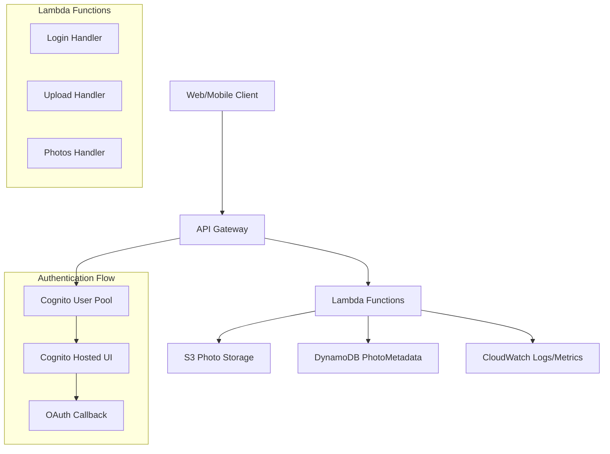

# Design Document

## Overview

The photo sharing backend transforms the existing Hello World Lambda application into a comprehensive serverless photo upload and sharing platform. The system leverages AWS serverless services to provide secure authentication, efficient photo storage, and scalable metadata management. The architecture follows AWS Well-Architected Framework principles with emphasis on security, reliability, and cost optimization.

## Architecture

### High-Level Architecture



### Request Flow

1. **Authentication Flow**: Client → API Gateway → Login Lambda → Cognito Hosted UI → OAuth Callback → JWT Tokens
2. **Upload Flow**: Client → API Gateway (JWT Auth) → Upload Lambda → Pre-signed S3 URL → Direct S3 Upload → DynamoDB Metadata
3. **Browse Flow**: Client → API Gateway → Photos Lambda → DynamoDB Query → Photo List Response

## Components and Interfaces

### API Gateway Configuration

**REST API Resource**: `PhotoSharingAPI`
- **Base URL**: `https://{api-id}.execute-api.{region}.amazonaws.com/{stage}`
- **CORS Configuration**: Enabled for web client access
- **Authorizer**: Cognito User Pool JWT authorizer for protected endpoints

**Endpoints**:
- `GET /login` - Public endpoint for authentication initiation
- `POST /upload` - Protected endpoint requiring JWT authentication
- `GET /photos` - Public endpoint for photo browsing

### Lambda Functions

#### Login Handler (`login_handler`)
**Purpose**: Manages OAuth authentication flow with Cognito
**Runtime**: Python 3.13, 256MB memory, 30s timeout
**Environment Variables**:
- `USER_POOL_ID`: Cognito User Pool identifier
- `CLIENT_ID`: Cognito App Client identifier
- `REDIRECT_URI`: OAuth callback URL

**Interface**:
```python
def login_handler(event: Dict[str, Any], context: LambdaContext) -> Dict[str, Any]:
    """
    Handles GET /login requests by redirecting to Cognito Hosted UI
    Returns: HTTP 302 redirect response with Cognito authorization URL
    """
```

#### Upload Handler (`upload_handler`)
**Purpose**: Generates pre-signed S3 URLs for authenticated photo uploads
**Runtime**: Python 3.13, 512MB memory, 30s timeout
**Environment Variables**:
- `BUCKET_NAME`: S3 bucket for photo storage
- `TABLE_NAME`: DynamoDB table for metadata

**Interface**:
```python
def upload_handler(event: Dict[str, Any], context: LambdaContext) -> Dict[str, Any]:
    """
    Handles POST /upload requests for authenticated users
    Input: {"filename": str, "contentType": str}
    Returns: {"uploadUrl": str, "photoId": str}
    """
```

#### Photos Handler (`photos_handler`)
**Purpose**: Retrieves paginated photo listings with randomization
**Runtime**: Python 3.13, 256MB memory, 30s timeout
**Environment Variables**:
- `TABLE_NAME`: DynamoDB table for metadata queries

**Interface**:
```python
def photos_handler(event: Dict[str, Any], context: LambdaContext) -> Dict[str, Any]:
    """
    Handles GET /photos requests with pagination
    Query Params: limit (default 10), lastKey (pagination token)
    Returns: {"items": List[PhotoItem], "lastKey": str | None}
    """
```

### AWS Cognito Configuration

**User Pool Setup**:
- **Pool Name**: `PhotoSharingUserPool`
- **Username Attributes**: Email address
- **Password Policy**: Minimum 8 characters, mixed case, numbers, symbols
- **MFA**: Optional (SMS or TOTP)

**App Client Configuration**:
- **Client Name**: `PhotoSharingWebClient`
- **Auth Flows**: Authorization code grant with PKCE
- **Scopes**: `openid`, `email`, `profile`
- **Callback URLs**: Application-specific redirect URLs
- **Logout URLs**: Application-specific logout URLs

**Hosted UI Configuration**:
- **Domain**: Custom domain or Cognito default
- **Sign-in/Sign-up Pages**: Customized branding
- **OAuth 2.0 Flows**: Authorization code grant

## Data Models

### DynamoDB Table: PhotoMetadata

**Table Configuration**:
- **Table Name**: `PhotoMetadata`
- **Partition Key**: `photoId` (String) - UUID v4 format
- **Sort Key**: `uploadedAt` (String) - ISO-8601 timestamp
- **Billing Mode**: On-demand for variable workloads
- **Global Secondary Index**: `UserPhotosIndex` on `userId` for user-specific queries

**Item Structure**:
```python
{
    "photoId": "550e8400-e29b-41d4-a716-446655440000",  # UUID v4
    "uploadedAt": "2024-01-15T10:30:00.000Z",           # ISO-8601
    "userId": "cognito-sub-identifier",                  # Cognito user sub
    "s3Key": "user123/photo456/vacation.jpg",          # S3 object key
    "contentType": "image/jpeg",                        # MIME type
    "metadata": {                                       # Optional metadata
        "caption": "Beautiful sunset",
        "tags": ["vacation", "sunset"],
        "location": "Beach Resort"
    }
}
```

### S3 Bucket Structure

**Bucket Organization**:
```
photo-sharing-bucket/
├── {userId}/
│   ├── {photoId}/
│   │   └── {originalFilename}
│   └── {photoId}/
│       └── {originalFilename}
└── {userId}/
    └── ...
```

**S3 Configuration**:
- **Bucket Name**: `photo-sharing-{environment}-{random-suffix}`
- **Versioning**: Enabled for data protection
- **Encryption**: AES-256 server-side encryption
- **Public Access**: Blocked (access via pre-signed URLs only)
- **Lifecycle Policy**: Transition to IA after 30 days, Glacier after 90 days

### Authentication Data Model

**JWT Token Structure** (from Cognito):
```json
{
  "sub": "user-uuid",
  "email": "user@example.com",
  "cognito:username": "username",
  "aud": "client-id",
  "iss": "https://cognito-idp.region.amazonaws.com/user-pool-id",
  "exp": 1640995200,
  "iat": 1640991600
}
```

## Error Handling

### Error Response Format

All endpoints return consistent error responses:
```json
{
  "error": {
    "code": "ERROR_CODE",
    "message": "Human-readable error message",
    "details": {
      "field": "Additional context when applicable"
    }
  }
}
```

### Error Categories

**Authentication Errors (401)**:
- `MISSING_TOKEN`: Authorization header missing
- `INVALID_TOKEN`: JWT token invalid or expired
- `TOKEN_EXPIRED`: JWT token has expired

**Validation Errors (400)**:
- `MISSING_REQUIRED_FIELD`: Required request field missing
- `INVALID_CONTENT_TYPE`: Content type not supported image format
- `INVALID_FILENAME`: Filename contains invalid characters

**Server Errors (500)**:
- `S3_ERROR`: S3 operation failed
- `DYNAMODB_ERROR`: DynamoDB operation failed
- `INTERNAL_ERROR`: Unexpected server error

### Error Handling Strategy

1. **Input Validation**: Validate all inputs before processing
2. **Graceful Degradation**: Return partial results when possible
3. **Retry Logic**: Implement exponential backoff for transient failures
4. **Circuit Breaker**: Prevent cascade failures in downstream services
5. **Structured Logging**: Log errors with correlation IDs for debugging

## Testing Strategy

### Unit Testing

**Test Coverage Requirements**: Minimum 95% code coverage
**Testing Framework**: pytest with coverage reporting
**Mock Strategy**: Mock AWS services using moto library

**Test Categories**:
- **Handler Tests**: Test each Lambda handler function
- **Validation Tests**: Test input validation logic
- **Error Handling Tests**: Test error scenarios and responses
- **Authentication Tests**: Test JWT token validation

### Integration Testing

**API Gateway Integration**:
- Test complete request/response flow
- Validate CORS configuration
- Test authorizer integration

**AWS Service Integration**:
- Test S3 pre-signed URL generation
- Test DynamoDB operations with test data
- Test Cognito authentication flow

### Performance Testing

**Load Testing Scenarios**:
- Concurrent upload requests (100 users)
- Photo listing with large datasets (10,000+ photos)
- Authentication token validation under load

**Performance Targets**:
- API response time: < 500ms (95th percentile)
- S3 pre-signed URL generation: < 200ms
- Photo listing query: < 300ms

### Security Testing

**Security Test Cases**:
- JWT token tampering attempts
- Unauthorized access to protected endpoints
- S3 pre-signed URL security validation
- Input sanitization and injection prevention

## Deployment Configuration

### SAM Template Structure

**Key Resources**:
- `PhotoSharingAPI`: API Gateway REST API
- `CognitoUserPool`: User authentication
- `PhotoBucket`: S3 storage for photos
- `PhotoMetadataTable`: DynamoDB table
- `LoginFunction`, `UploadFunction`, `PhotosFunction`: Lambda handlers

**Environment-Specific Configuration**:
- **Development**: Relaxed CORS, debug logging enabled
- **Staging**: Production-like configuration for testing
- **Production**: Strict security, optimized performance settings

### Infrastructure as Code

**SAM Template Features**:
- Parameter-driven configuration for different environments
- Conditional resource creation based on environment
- Automated IAM role creation with least privilege principles
- CloudFormation outputs for client application configuration

**Deployment Pipeline**:
1. **Build**: SAM build with dependency resolution
2. **Test**: Run unit and integration tests
3. **Security Scan**: Static analysis and vulnerability scanning
4. **Deploy**: Environment-specific deployment with rollback capability
5. **Smoke Test**: Post-deployment validation

### Monitoring and Observability

**AWS Lambda Powertools Integration**:
- **Structured Logging**: JSON-formatted logs with correlation IDs
- **Custom Metrics**: Business metrics (uploads, photo views, errors)
- **Distributed Tracing**: X-Ray integration for request flow visibility

**CloudWatch Alarms**:
- Lambda function errors and duration
- API Gateway 4xx/5xx error rates
- DynamoDB throttling and errors
- S3 operation failures

**Dashboards**:
- Real-time application health dashboard
- Business metrics dashboard (uploads, active users)
- Performance monitoring dashboard